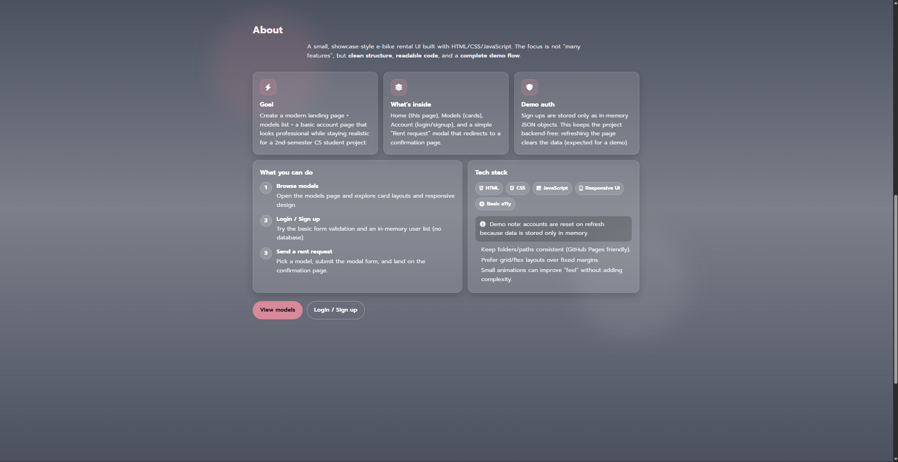
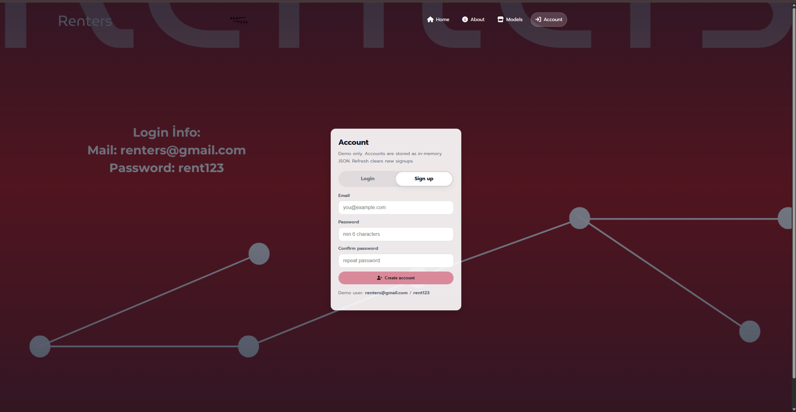
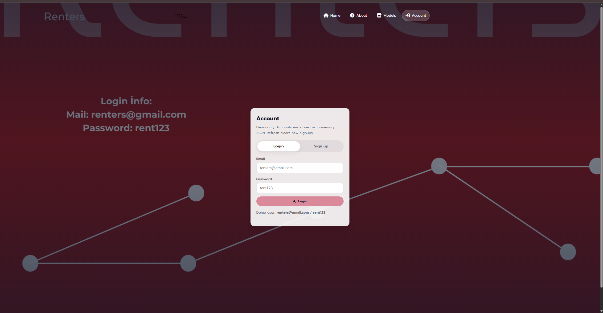
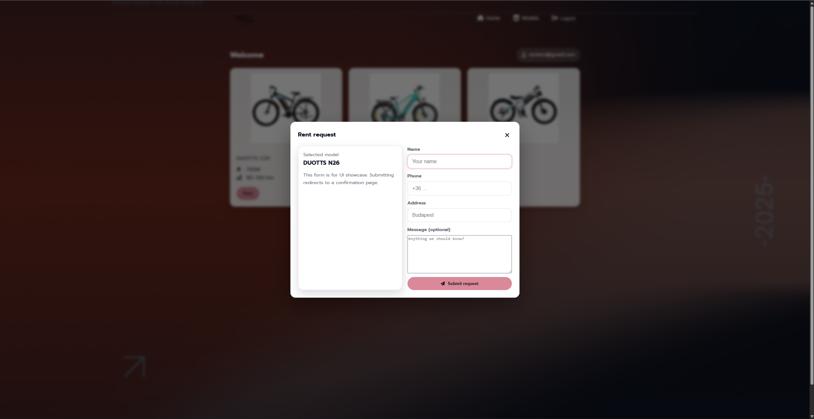
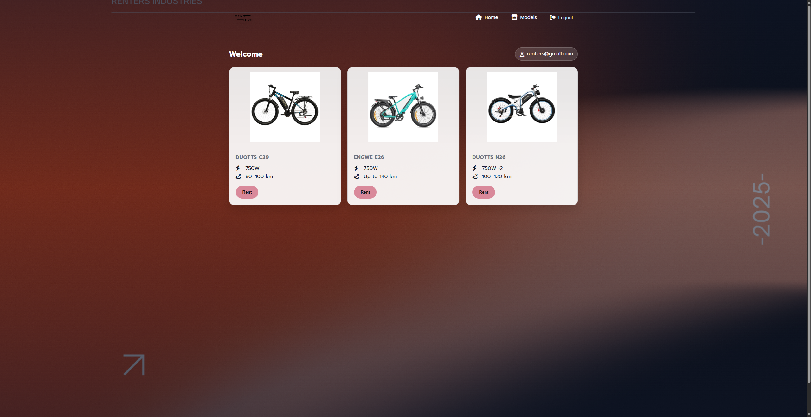

# E-Bike Rental Demo (Static)

A portfolio-ready **front-end e-bike rental demo** built with **HTML, CSS, and Vanilla JavaScript**.  
It demonstrates a clean repo structure, responsive UI, and a complete **login → dashboard → rent request** user flow.

**Highlights:** Responsive UI • In-memory auth/state • Modal-based rent request • Scroll-reveal animations

> **Scope (intentional):** This is a **static demo**. Users and requests are stored **in memory** (JS state), so refreshing the page resets newly created data.

---

## Live Demo
- https://cntzemir.github.io/e-bike-rental-demo/
---


## What a Reviewer Can Verify Quickly
- **Can run instantly** (open the demo link / open `index.html`)
- **Clear structure** (`assets/`, `docs/`, predictable file naming)
- **Working flow:** Home → Login/Register → Dashboard → Rent modal → Confirmation page
- **UX details:** responsive layout, consistent spacing, scroll-reveal animation
- **Code hygiene:** separation of concerns (HTML/CSS/JS), minimal duplication, readable naming

---

## Screenshots

| Home | About (Scroll-reveal) |
|---|---|
|  |   |

| Register | Login |
|---|---|
|  |  |

| Rent Request | Dashboard |
|---|---|
|  |  |

---

## Features

### UI / UX
- Responsive layout (grid/cards) with consistent spacing
- Simple multi-page navigation and clear user journey
- About section **scroll-reveal** animation using `IntersectionObserver`

### Authentication (Demo)
- Login + Sign up flow
- Users stored in an **in-memory** state object (no backend)
- Validation:
  - email format
  - password length
  - confirm password match

### Rental Flow
- Dashboard page includes a **Rent** modal
- Submitting creates a **request object** in memory
- Redirects to confirmation page: `request-submitted.html`

---

## Demo Account
Use the included demo user:
- Email: `renters@gmail.com`
- Password: `rent123`

(Or create a new account via **Sign up** — resets on refresh.)

---

## Tech Stack
- **HTML5**
- **CSS3** (variables, responsive layout)
- **Vanilla JavaScript** (DOM events, simple state management, `IntersectionObserver`)

---

## Run Locally
**Option A — Open directly**
1. Download / clone the repository
2. Open `index.html` in your browser

**Option B — Local server (recommended)**
- VS Code → install **Live Server**
- Right-click `index.html` → **Open with Live Server**

---

## Project Structure
```txt
.
├─ index.html
├─ models.html
├─ user_page.html
├─ request-submitted.html
├─ assets/
│  ├─ css/
│  │  └─ style.css
│  ├─ js/
│  │  ├─ user_page.js
│  │  └─ reveal.js
│  └─ img/
├─ docs/
│  └─ screenshots/
├─ CHANGELOG.md
└─ LICENSE
