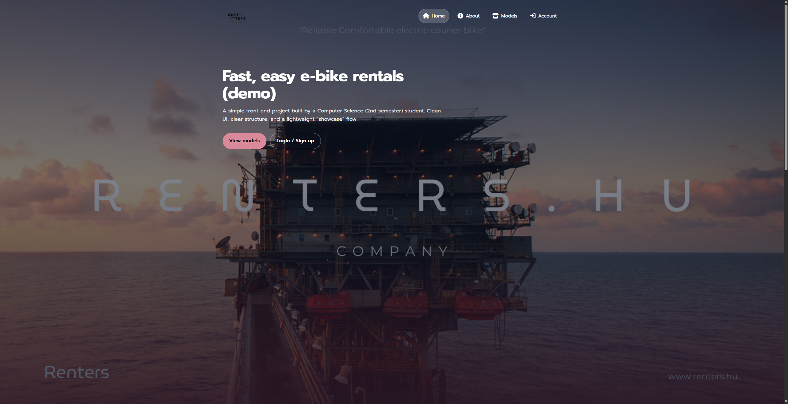

# E-Bike Rental Demo (Static)

A front-end **e-bike rental demo website** built with **HTML / CSS / Vanilla JavaScript**.  
The project focuses on **clean structure**, **responsive UI**, and a simple but complete **login → dashboard → rent flow**.

> **Scope note (intentional):** Authentication and data are **in-memory only** (a small JS state object).  
> Refreshing the page resets newly created accounts and requests — this is expected for a static demo.

---

## Live Demo
- Demo: **(add your GitHub Pages link here)**

---

## Screenshots
Place images under `docs/screenshots/` and update paths below:
- 
- 
- 

---

## Key Features

### UI & UX
- Responsive layout (grid/cards) with consistent spacing
- Clear navigation and a simple multi-page flow
- “About” section **scroll-reveal** animation using `IntersectionObserver`

### Auth (Demo)
- Login / Sign up experience
- Users stored in an **in-memory JS state**
- Minimal validation:
  - email format
  - password length
  - confirm password match

### Rental Flow
- Dashboard page with a **Rent modal**
- Submitting a rent request creates a **request object** in memory
- Redirects to a **confirmation page** (`request-submitted.html`)

### Code Quality / Maintenance
- Standardized structure with `assets/` folder
- Removed unused/broken dependencies and fixed broken links
- Clear separation: layout (HTML) / styling (CSS) / behavior (JS)

---

## Demo Credentials
Use the demo account:
- Email: `renters@gmail.com`
- Password: `rent123`

Or create a new account via **Sign up** (resets on refresh).

---

## Tech Stack
- **HTML5**
- **CSS3** (variables, responsive layout)
- **Vanilla JavaScript** (DOM events, state management, `IntersectionObserver`)

---

## Project Structure
```txt
.
├─ index.html
├─ models.html
├─ user_page.html
├─ request-submitted.html
├─ assets/
│  ├─ css/
│  │  └─ style.css
│  ├─ js/
│  │  ├─ user_page.js
│  │  └─ reveal.js
│  └─ img/
├─ docs/
│  └─ screenshots/
├─ CHANGELOG.md
└─ LICENSE

How to Run Locally
Option 1 — Open directly
Open index.html in your browser.

Option 2 — Local server (recommended)
If you use VS Code:

Install Live Server

Right-click index.html

Select Open with Live Server

Learning Goals (What this project demonstrates)
Building a small multi-page front-end flow

DOM event handling and predictable UI behavior

Basic state management (single source of truth approach)

Responsive layout with reusable UI patterns

Improving UX with animation triggers (IntersectionObserver)

Roadmap (Optional)
Persist data with localStorage (keep current as demo by default)

Add better form validation + inline error messages

Add a simple “My Rentals” history section

Add accessibility improvements (focus states, ARIA for modal)
